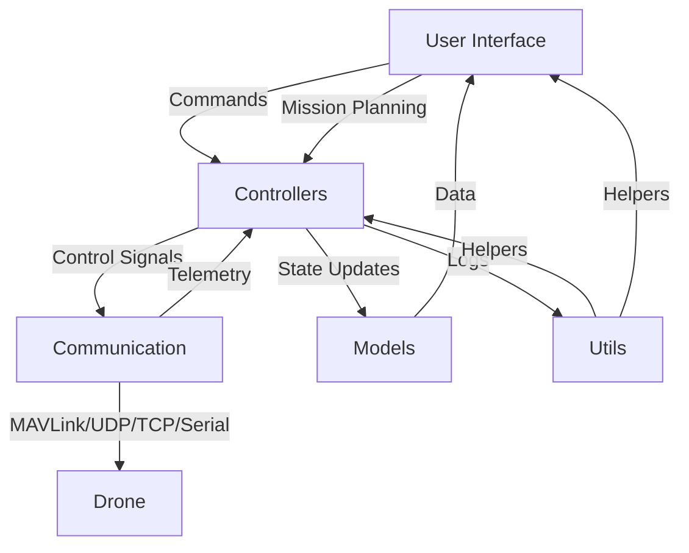

# Ground Control Station (GCS) for Drone


> **Note:** This software is **still in active development**. Many features are experimental or not fully implemented yet. Expect incomplete functionality and ongoing changes.

Ground Control Station (GCS) is a comprehensive application for monitoring and controlling drones. It offers a modern, user-friendly interface for real-time telemetry, mission planning, and visualization, making it ideal for both research and field operations.

---

## Table of Contents
- [Overview](#overview)
- [Architecture](#architecture)
- [Features](#features)
- [Folder Structure](#folder-structure)
- [Installation](#installation)
- [Configuration](#configuration)
- [Usage](#usage)
- [Contributing](#contributing)

---

## Overview

This GCS application enables users to:
- Monitor drone telemetry in real-time (altitude, speed, battery, etc.)
- Plan and upload autonomous missions with waypoints
- Visualize the drone's position and path on a live map
- Send commands and receive status updates
- Analyze logs and visualize flight data
- Send images from the GCS to the drone for advanced mission scenarios (e.g., image-based navigation or payload delivery).
- Communicate with drones over **UDP, TCP, and serial (radio) connections** for maximum flexibility and compatibility.

## Architecture


The application is modular, with clear separation between UI, controllers, communication, models, and utilities.

**Communication Layer:**
- Supports multiple protocols: **UDP, TCP, and serial (radio)** for robust connectivity with a wide range of drone hardware and simulators.



## Features

> **Development Status:** Many features listed below are partially implemented or planned for future releases. See issues and pull requests for current progress.

- **Real-time Telemetry**: Live updates for altitude, speed, battery, GPS, and more.
- **Mission Planning**: Intuitive waypoint editor and mission uploader. _(Under Development)_
- **Map View**: Map with drone position and path. _(Under Development)_
- **Attitude Indicator**: Real-time orientation visualization graph.
- **Command Panel**: Manual and automated command interface.
- **Status Bar**: Application and drone status at a glance.
- **Log Panel**: View and export logs for analysis.
- **Camera Feed**: (If supported) Live video streaming from drone camera.
- **Modular UI**: Easily extendable with custom widgets and dialogs.
 - **Image Sending**: Transmit images from the GCS to the drone for tasks such as image-based missions or remote payload updates.
 - **Multi-Protocol Communication**: Connect to drones using **UDP, TCP, or serial (radio)** links for versatile deployment in different environments.

## Folder Structure

```
src/
  app.py                  # Application entry point
  main.py                 # Main launcher
  communication/          # MAVLink, serial, UDP handlers
  config/                 # Settings and configuration
  controllers/            # Flight, mission, telemetry controllers   
  models/                 # Data models (drone state, mission, waypoint)
  ui/                     # UI components, dialogs, widgets
  utils/                  # Utilities (logger, coordinate utils, etc.)
requirements.txt          # Python dependencies
README.md                 # Project documentation
```

## Installation

1. Clone the repository:
   ```
   git clone <repository-url>
   ```
2. Navigate to the project directory:
   ```
   cd drone-gcs
   ```
3. Install the required dependencies:
   ```
   pip install -r requirements.txt
   ```

## Usage

To start the Ground Control Station, run the following command:
```
python src/main.py
```

## Contributing

Contributions are welcome! Please:
- Open an issue for bugs or feature requests
- Fork the repo and submit a pull request
- Follow PEP8 and write clear commit messages
