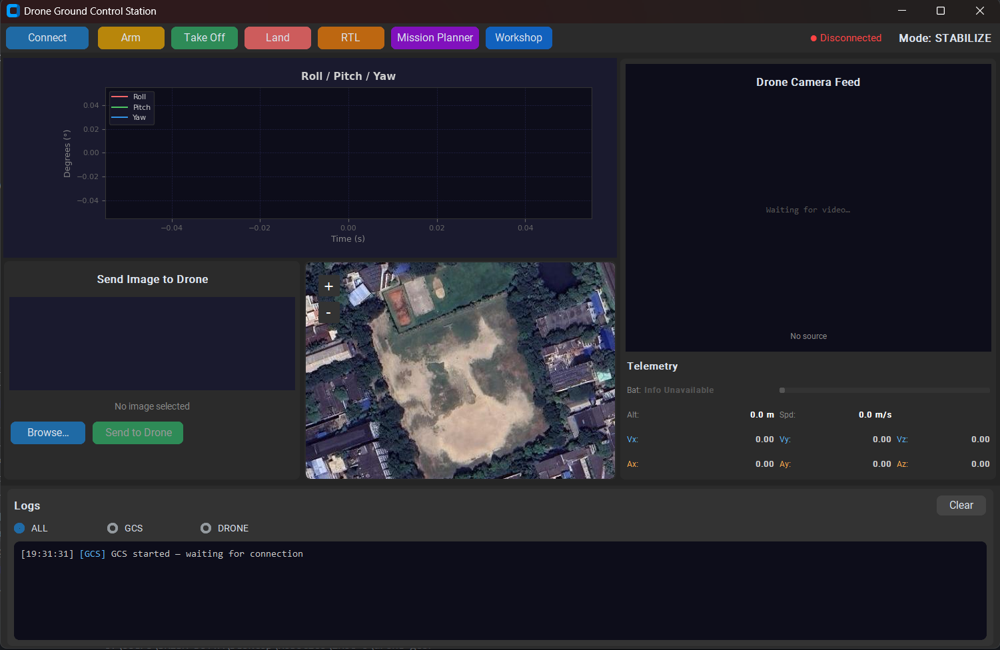
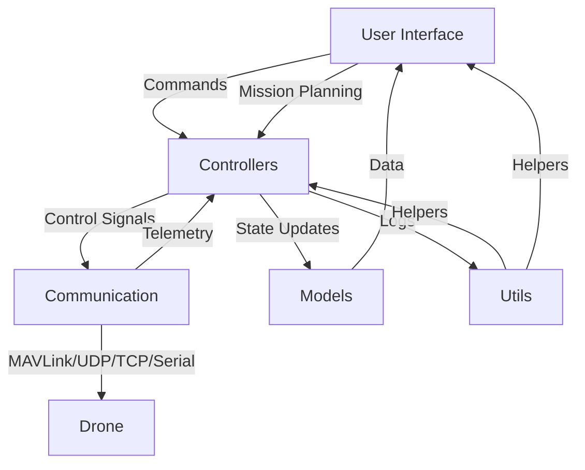

# Ground Control Station (GCS) for Drone

> **Note:** This software is **still in active development**. Many features are experimental or not fully implemented yet. Expect incomplete functionality and ongoing changes.

Ground Control Station (GCS) is a comprehensive application for monitoring and controlling drones. It offers a modern, user-friendly interface for real-time telemetry, mission planning, and visualization, making it ideal for both research and field operations.

---

## Table of Contents
- [Overview](#overview)
- [Screenshots](#screenshots)
- [Architecture](#architecture)
- [Features](#features)
- [Folder Structure](#folder-structure)
- [Installation](#installation)
- [Usage](#usage)
- [Drone-Side Communication Protocols](#drone-side-communication-protocols)
- [Configuration](#configuration)
- [Contributing](#contributing)

---

## Overview

This GCS application enables users to:
- Monitor drone telemetry in real-time (altitude, speed, battery, etc.)
- Plan and upload autonomous missions with waypoints
- Visualize the drone's position and path on a live map
- Send commands and receive status updates
- Analyze logs and visualize flight data
- Send images from the GCS to the drone for advanced mission scenarios (e.g., image-based navigation or payload delivery).
- Communicate with drones over **UDP, TCP, and serial (radio) connections** for maximum flexibility and compatibility.

## Screenshots

Main Window:



## Architecture


The application is modular, with clear separation between UI, controllers, communication, models, and utilities.

**Communication Layer:**
- Supports multiple protocols: **UDP, TCP, and serial (radio)** for robust connectivity with a wide range of drone hardware and simulators.



## Features

> **Development Status:** Many features listed below are partially implemented or planned for future releases. See issues and pull requests for current progress.

- **Real-time Telemetry**: Live updates for altitude, speed, battery, GPS, and more.
- **Mission Planning**: Intuitive waypoint editor and mission uploader. _(Under Development)_
- **Map View**: Map with drone position and path. _(Under Development)_
- **Attitude Indicator**: Real-time orientation visualization graph.
- **Command Panel**: Manual and automated command interface.
- **Status Bar**: Application and drone status at a glance.
- **Log Panel**: View and export logs for analysis.
- **Camera Feed**: (If supported) Live video streaming from drone camera.
- **Modular UI**: Easily extendable with custom widgets and dialogs.
 - **Image Sending**: Transmit images from the GCS to the drone for tasks such as image-based missions or remote payload updates.
 - **Multi-Protocol Communication**: Connect to drones using **UDP, TCP, or serial (radio)** links for versatile deployment in different environments.

## Folder Structure

```
src/
  app.py                  # Application entry point
  main.py                 # Main launcher
  communication/          # MAVLink, serial, UDP handlers
  config/                 # Settings and configuration
  controllers/            # Flight, mission, telemetry controllers   
  models/                 # Data models (drone state, mission, waypoint)
  ui/                     # UI components, dialogs, widgets
  utils/                  # Utilities (logger, coordinate utils, etc.)
requirements.txt          # Python dependencies
README.md                 # Project documentation
```

## Installation

1. Clone the repository:
   ```
   git clone <repository-url>
   ```
2. Navigate to the project directory:
   ```
   cd drone-gcs
   ```
3. Install the required dependencies:
   ```
   pip install -r requirements.txt
   ```

## Usage

To start the Ground Control Station, run the following command:
```
python src/main.py
```

## Drone-Side Communication Protocols

This section describes the expected formats for telemetry, video, and image packets sent **from the drone to the GCS**. Implement your drone-side code to match these formats for seamless integration.

### Telemetry Packets

- **Format:** JSON (UTF-8 encoded, sent over UDP/TCP/Serial)
- **Example Packet:**
  ```json
  {
    "altitude": 123.4,
    "vx": 1.2,
    "vy": 0.0,
    "vz": -0.5,
    "battery": 87,
    "ax": 0.01,
    "ay": 0.02,
    "az": 9.8,
    "roll": 0.0,
    "pitch": 0.0,
    "yaw": 180.0,
    "flight_mode": "AUTO",
    "armed": true,
    "lat": 37.123456,
    "lon": -122.123456,
    "north": 10.0,
    "east": 5.0
  }
  ```
- **Required Fields:**  
  `altitude`, `vx`, `vy`, `vz`, `battery`, `ax`, `ay`, `az`, `roll`, `pitch`, `yaw`, `flight_mode`, `armed`, `lat`, `lon`, `north`, `east`
- **Notes:**  
  - The GCS will parse and use these fields for display and control.
  - Send packets at a regular interval (e.g., 5–20 Hz).
  - Use `json.dumps(data).encode('utf-8')` to serialize and send.

### Video Streaming Packets

- **Format:** JPEG frames split into UDP chunks with a custom header.
- **Header Structure:** 9 bytes, big-endian: `>3sBHH`
  - `magic` (3 bytes): Always `b"VID"`
  - `frame_id` (1 byte): Unique ID for each frame (0–255, increment per frame)
  - `chunk_index` (2 bytes): Index of this chunk (0-based)
  - `total_chunks` (2 bytes): Total number of chunks for this frame
- **Packet Structure:**  
  `[HEADER][JPEG CHUNK DATA]`
- **Sending Steps:**
  1. Encode a video frame as JPEG (`cv2.imencode('.jpg', frame)[1].tobytes()`).
  2. Split the JPEG bytes into chunks (max 1024 bytes per chunk recommended).
  3. For each chunk, prepend the header and send via UDP to the GCS video port (default: 2050).
  4. Increment `frame_id` for each new frame.
- **Example (Python):**
  ```python
  import struct
  MAX_CHUNK = 1024
  frame_id = (frame_id + 1) % 256
  chunks = [jpeg_bytes[i:i+MAX_CHUNK] for i in range(0, len(jpeg_bytes), MAX_CHUNK)]
  for idx, chunk in enumerate(chunks):
      header = struct.pack('>3sBHH', b'VID', frame_id, idx, len(chunks))
      sock.sendto(header + chunk, (gcs_ip, gcs_port))
  ```

### Image Receiving Packets (GCS → Drone)

- **Format:** JPEG or PNG image split into UDP chunks with a custom header.
- **Header Structure:** 9 bytes, big-endian: `>3sBHH`
  - `magic` (3 bytes): Always `b"IMG"`
  - `image_id` (1 byte): Unique ID for this image (0–255)
  - `chunk_index` (2 bytes): Index of this chunk (0-based)
  - `total_chunks` (2 bytes): Total number of chunks for this image
- **Packet Structure:**  
  `[HEADER][IMAGE CHUNK DATA]`
- **Receiving Steps:**
  1. Listen for UDP packets on the chosen port.
  2. For each packet with `magic == b"IMG"`, buffer the chunk by `image_id` and `chunk_index`.
  3. When all chunks for an `image_id` are received, reassemble in order and save/process the image.

---

**Summary Table:**

| Data Type | Protocol        | Format         | Header                | Notes                                 |
|-----------|----------------|----------------|-----------------------|---------------------------------------|
| Telemetry | UDP/TCP/Serial | JSON           | None                  | UTF-8 encoded, newline-delimited      |
| Video     | UDP            | JPEG chunks    | `>3sBHH` (`VID`)      | Each frame split into chunks          |
| Image     | UDP            | JPEG/PNG chunks| `>3sBHH` (`IMG`)      | Each image split into chunks          |

---

**Tip:** See the `UDPServer`, `CameraFeed`, and `ImageSendPanel` classes in the codebase for more implementation details.

## Configuration

The main configuration for the GCS is located in `src/config/settings.py` in the `Config` class. You can adjust the following variables to suit your setup:

- **DRONE_IP**: IP address of the drone (default: `192.168.1.1`)
- **DRONE_PORT**: Port for drone communication (default: `14550`)
- **WINDOW_TITLE**: Title of the main application window
- **WINDOW_WIDTH**: Width of the main window in pixels
- **WINDOW_HEIGHT**: Height of the main window in pixels
- **TELEMETRY_UPDATE_INTERVAL**: Telemetry update interval in milliseconds (default: `1000` ms)
- **MAP_TILE_SERVER**: URL template for map tiles (default: Google satellite)
- **GPS_ACTIVE**: Enable/disable GPS mode (default: `True`)
- **HOME_LAT**: Default map center latitude (default: `22.4977117`)
- **HOME_LON**: Default map center longitude (default: `88.3721941`)
- **DEFAULT_ZOOM**: Default map zoom level (default: `18`)

You can add or modify settings as needed for your deployment.

## Contributing

Contributions are welcome! Please:
- Open an issue for bugs or feature requests
- Fork the repo and submit a pull request
- Follow PEP8 and write clear commit messages

---